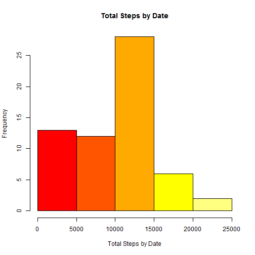
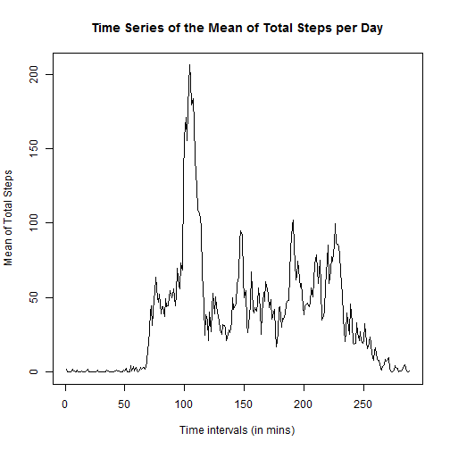
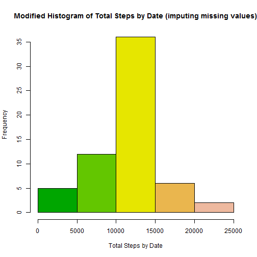
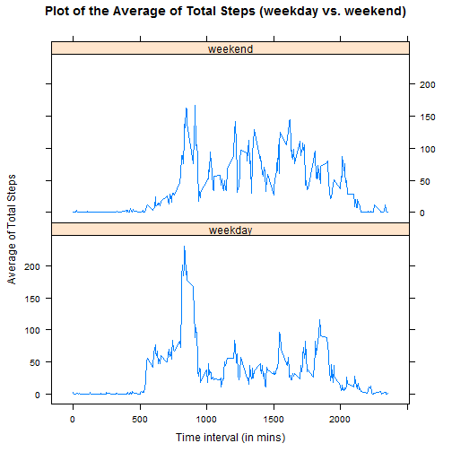

# Coursera Project Assignment - 1 - dt. Sep-2017
##Loading and preprocessing the data

```r
activity <- read.csv("activity.csv", colClasses=c("numeric","Date","numeric"))
str(activity)
```

```
## 'data.frame':	17568 obs. of  3 variables:
##  $ steps   : num  NA NA NA NA NA NA NA NA NA NA ...
##  $ date    : Date, format: "2012-10-01" "2012-10-01" ...
##  $ interval: num  0 5 10 15 20 25 30 35 40 45 ...
```


##What is mean total number of steps taken per day?

```r
sum_by_date <- tapply(activity$steps,activity$date,sum,na.rm=TRUE)
hist(sum_by_date,col=heat.colors(5),xlab="Total Steps by Date",main="Total Steps by Date")
```


The mean and median of the total number of steps taken per day is as follows:

Mean - 9354.2295082

Median - 1.0395 &times; 10<sup>4</sup>


##What is the average daily activity pattern?
1. Make a time series plot (i.e. type = "l") of the 5-minute interval (x-axis) and the average number of steps taken, averaged across all days (y-axis)

```r
avg_across_int <- tapply(activity$steps, activity$interval, mean, na.rm = TRUE)
plot(avg_across_int, type = "l", xlab="Time intervals (in mins)",ylab="Mean of Total Steps",main="Time Series of the Mean of Total Steps per Day")
```


2. Which 5-minute interval, on average across all the days in the dataset, contains the maximum number of steps?

Step 1 - max of average_across_days

Step 2 - find location within the vector

Step 3 - use location to find max value


```r
x <- max(avg_across_int)
match_max <- match(x, avg_across_int)
avg_across_int[match_max]
```

```
##      835 
## 206.1698
```
Answer is 835 arrived as above

##Imputing missing values

1. Calculate and report the total number of missing values in the dataset (i.e. the total number of rows with NAs)
This can be done with the is.na() function, summed over the dataset: that is:

```r
sum(is.na(activity))
```

```
## [1] 2304
```
2. Devise a strategy for filling in all of the missing values in the dataset. 
I will replace all missing values with the average across an interval (avg_across_int). This is done by splitting the dataset based on NA/non-NA, then replacing the missing values as follows:

```r
activity_na <- activity[is.na(activity), ]
activity_notna <- activity[complete.cases(activity), ]
activity_na$steps <- as.numeric(avg_across_int)
```

3. Create a new dataset that is equal to the original dataset but with the missing data filled in.
Combining the two datasets as follows:

```r
new_activity <- rbind(activity_na, activity_notna)
new_activity <- new_activity[order(new_activity[,2], new_activity[,3]),]
```

4. Make a histogram of the total number of steps taken each day and Calculate and report the mean and median total number of steps taken per day. Do these values differ from the estimates from the first part of the assignment? What is the impact of imputing missing data on the estimates of the total daily number of steps?

This can be done using the tapply() function that sums steps across date factors, that is: 

```r
new_sum_by_date <- tapply(new_activity$steps,new_activity$date,sum)
hist(new_sum_by_date,col=terrain.colors(6),xlab="Total Steps by Date",main="Modified Histogram of Total Steps by Date (imputing missing values)")
```



Mean and Median of the modified dataset as follows:

```r
mean(new_sum_by_date)
```

```
## [1] 10766.19
```

```r
median(new_sum_by_date)
```

```
## [1] 10766.19
```

Impact of imputing missing values: The histogram pattern appears closer to the normal distribution pattern, which is as expected given we are "rectifying" the dataset by such substitution.

##Are there differences in activity patterns between weekdays and weekends?

For this part the weekdays() function may be of some help here. Use the dataset with the filled-in missing values for this part.

```r
days <- weekdays(new_activity[,2])
new_activity <- cbind(new_activity, days)
```
Create a new factor variable in the dataset with two levels - "weekday" and "weekend" indicating whether a given date is a weekday or weekend day.

```r
library(plyr)
new_activity$days <- revalue(new_activity$days, c("Monday"="weekday","Tuesday"="weekday","Wednesday"="weekday","Thursday"="weekday","Friday"="weekday", "Saturday" = "weekend", "Sunday" = "weekend"))
```

Make a panel plot containing a time series plot (i.e. type = "l") of the 5-minute interval (x-axis) and the average number of steps taken, averaged across all weekday days or weekend days (y-axis). See the README file in the GitHub repository to see an example of what this plot should look like using simulated data.

```r
new_avg_across_int <- tapply(new_activity$steps, list(new_activity$interval, new_activity$days), mean)
library(reshape2)
new_avg_across_int <- melt(new_avg_across_int)
colnames(new_avg_across_int) <- c("interval", "days", "steps")
library(lattice)
xyplot(new_avg_across_int$steps ~ new_avg_across_int$interval | new_avg_across_int$days, layout=c(1,2),type="l",main="Plot of the Average of Total Steps (weekday vs. weekend)",xlab="Time interval (in mins)",ylab="Average of Total Steps")
```



# End of Assignment 
